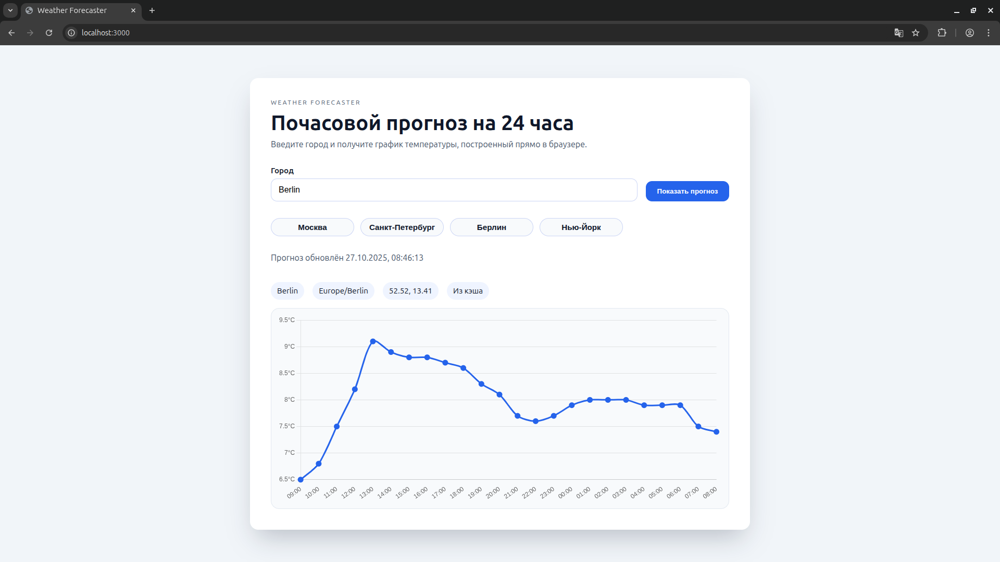

# Weather by City

Приложение отображает почасовой прогноз температуры на ближайшие сутки. Пользователь вводит город, сервис обращается к Open-Meteo за координатами и прогнозом, кэширует ответ и сразу рисует график прямо в браузере.



## Возможности
- Поиск прогноза по любому городу и пресетам (Москва, Санкт-Петербург, Berlin, New York)
- Почасовой график на 24 часа поверх Chart.js с skeleton-состоянием во время загрузки
- Единый `/weather` API, который валидирует запросы и возвращает компактный JSON
- Redis-кэш с автоматическим фолбэком на in-memory реализацию
- Простой health-чек `/health` для мониторинга

## Технологии
- **Backend:** Node.js, Express 5, TypeScript
- **Frontend:** Встроенное SPA на ванильном JS + Chart.js
- **Интеграции:** Open-Meteo Geocoding API и Open-Meteo Forecast API
- **Кэш:** Redis (опционально, можно работать без него)

## Требования
- Node.js ≥ 20
- npm ≥ 10
- (опционально) redis-сервер, если нужен persistent-кэш

## Быстрый старт
```bash
git clone https://github.com/timu-ryan/weather-by-city.git
cd weather-by-city
npm install
```

Создайте `.env` (все переменные необязательные):
```bash
PORT=3000
CACHE_TTL_MINUTES=15
REDIS_URL=redis://localhost:6379
```

### Режим разработки
```bash
npm run dev
```
Приложение стартует на `http://localhost:3000`, статические файлы лежат в `public/`.

### Production
```bash
npm run build
npm start
```
`npm run lint` запускает проверку типов (tsc) без генерации артефактов.

## Архитектура
- `src/app.ts` — конфигурация Express и маршрутизация
- `src/services/*` — слой интеграций: геокодер, прогноз, кэш
- `public/*` — SPA, которое запрашивает API и рендерит график
- `screenshots/mainPage.png` — актуальный вид главного экрана

## API
### `GET /weather?city=<string>`
Возвращает прогноз для переданного города.

Пример ответа:
```json
{
  "city": "Moscow",
  "coordinates": { "latitude": 55.75, "longitude": 37.62 },
  "hourly": [
    { "time": "2024-05-20T12:00:00Z", "temperature": 18.3 }
  ],
  "timezone": "Europe/Moscow",
  "fetchedAt": "2024-05-20T09:15:33.123Z",
  "source": "api"
}
```

Статусы:
- `200` — успех
- `400` — пустой или некорректный `city`
- `404` — город не найден
- `500` — ошибка сервера или внешнего API

### `GET /health`
Возвращает `{ "status": "ok" }`, используется мониторингом.

## Клиент
1. Введите название города или выберите один из пресетов.
2. Нажмите «Показать прогноз».
3. В статус-панели появится время обновления, ниже — блок мета-данных и график.
4. Источник данных (`api` или `cache`) отображается в мета-блоке.

## Троблшутинг
- **Chart.js не прогружается** — проверьте наличие CDN в `public/index.html` или замените на локальный бандл.
- **Пустой ответ** — Open-Meteo может не найти населённый пункт, попробуйте уточнить название.
- **Redis недоступен** — приложение автоматически переключится на in-memory кэш, но данные не переживут рестарт.
